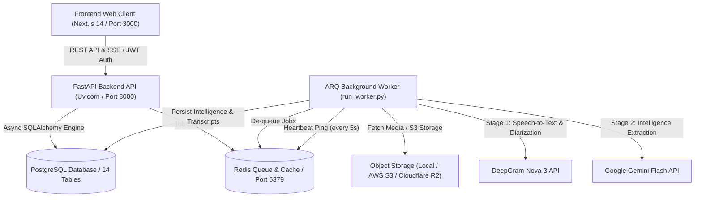

# 🎙️ MeetingMind — Comprehensive Project Engineering Report
**AI Meeting Intelligence Platform**

---

## 👥 Engineering Team & Contributions

| # | Team Member | Primary Roles & Key Contributions |
|---|---|---|
| 1 | **Muhammad Mujeeb Ur Rahman** | **AI Engineering, Backend API & System Integration**<br>• Designed and implemented the dual-stage AI orchestration pipeline (DeepGram Nova-3 + Google Gemini Flash).<br>• Built the async background worker (`run_worker.py`) with cross-platform Windows signal handling and Redis heartbeat monitoring.<br>• Implemented multi-model fallback and exponential backoff retry systems for LLM rate limits (429/503).<br>• Developed the contextual RAG Q&A engine with millisecond timestamp extraction and citations.<br>• Architected core FastAPI routers, JWT authentication, and administrative queue management endpoints. |
| 2 | **Hasham Khattak** | **Database Architecture & Data Engineering**<br>• Architected the 14-table relational database schema on PostgreSQL (Supabase).<br>• Configured PostgreSQL native enum types (`user_role`, `action_item_status`) and relational integrity.<br>• Implemented Alembic database migrations (`server/alembic/`) and SQLAlchemy automap reflection.<br>• Enforced data integrity check constraints (`completed_at >= started_at`) and UUID foreign key validation. |
| 3 | **Minahil Azhar** | **Quality Assurance & Automated Testing**<br>• Designed the comprehensive automated testing suite across unit, black-box, and full-pipeline integration tests.<br>• Built 30 automated test cases achieving a **100% test pass rate** (30/30 tests passing).<br>• Created edge-case test suites for token tampering, token expiry, timestamp boundary parsing, magic bytes detection, and rate limiting.<br>• Conducted end-to-end live testing with real synthetic audio, speech recordings, and MP4 video files. |
| 4 | **Muhammad Anas** | **Frontend Engineering & UI/UX Design**<br>• Developed the responsive web client using Next.js 14, TypeScript, and Tailwind CSS.<br>• Built the interactive dashboard with stats overview, recent meetings, upcoming deadlines, and decision widgets.<br>• Engineered the "Ask AI" conversational interface with discrete chat bubbles, optimistic loading, and clickable timestamp seeking (`▶ [MM:SS]`).<br>• Designed and integrated the animated **Light & Dark Theme Switcher** with persistent state and custom styling.<br>• Implemented React Error Boundaries and live multi-step processing stage polling. |

---

## 📌 Executive Summary

Modern organizations spend countless hours in meetings, yet critical decisions, action items, deadlines, and unresolved questions are frequently lost in notes or forgotten. **MeetingMind** is an enterprise-grade, full-stack AI Meeting Intelligence Platform designed to automate the entire post-meeting lifecycle. 

By uploading audio or video recordings (`.mp3`, `.wav`, `.m4a`, `.mp4`, `.mov`, `.webm`), MeetingMind automatically extracts high-fidelity speech transcripts with speaker diarization, generates short and detailed executive summaries, pinpoints action items with assignees and due dates, logs key decisions and unresolved issues, performs sentiment analysis, and enables grounded conversational Q&A where users can ask questions and immediately jump to exact spoken moments in the recording.

---

## 🏗️ System Architecture

MeetingMind is built on a decoupled, microservices-ready architecture:



---

## 🌟 Core Modules & Technical Capabilities

### 1. Multi-Format Media Ingestion & Storage
- Supports audio (`.mp3`, `.wav`, `.m4a`) and video (`.mp4`, `.mov`, `.webm`) up to 500MB.
- Automatic SHA-256 checksum calculation for upload integrity and deduplication.
- Magic-byte validation to prevent extension spoofing.
- Graceful FFmpeg audio extraction with fallback directly to source media when running in environments without FFmpeg binaries.
- Pluggable storage driver (`local` disk storage for development, `s3` for production AWS S3 / Cloudflare R2).

### 2. Stage 1: DeepGram Nova-3 Transcription & Diarization
- Uses DeepGram's state-of-the-art **Nova-3** speech model.
- Automatically separates and identifies distinct speakers (`Speaker 0`, `Speaker 1`, etc.).
- Produces word-level and utterance-level timestamps (`start_time_seconds`, `end_time_seconds`).
- Segments transcripts into searchable, diarized chunks persisted in `transcript_segments` and `speakers`.

### 3. Stage 2: Google Gemini Meeting Intelligence Extraction
- Structures the entire transcript and feeds it to Google Gemini with a rigorous JSON Schema.
- **Executive Summaries**: Produces a concise 2-3 sentence overview (`summary_short`) and a detailed multi-paragraph narrative (`summary_detailed`).
- **Action Items**: Extracts actionable tasks, parses assignees as valid UUIDs, and resolves natural-language deadlines (`deadline_raw_text` and ISO `deadline_date`).
- **Decisions & Deadlines**: Identifies all finalized agreements and concrete calendar deadlines.
- **Unresolved Issues & Blockers**: Tracks open questions tabled for future meetings.
- **Sentiment Analysis**: Computes meeting sentiment (`positive`, `neutral`, `negative`, `mixed`) with a normalized score (`-1.0` to `+1.0`).
- **Multi-Model Fallback & Backoff**: Automatically falls back across active models (`gemini-flash-latest`, `gemini-3.5-flash`, `gemini-3.7-flash`, etc.) with exponential backoff retry to prevent rate-limit interruptions.

### 4. Contextual "Ask AI" (RAG) with Spoken Timestamp Citations
- Users can query the meeting via an interactive chat interface.
- Retrieves full diarized context and transcript offsets.
- Gemini answers strictly grounded in meeting facts and provides spoken timestamp citations (e.g. `[02:15]`).
- The frontend parses timestamp tags into interactive chips (`▶ [02:15]`), allowing users to click and instantly seek the audio player to the exact second where the statement was made.

### 5. Dual-Theme Engine (Light & Dark Themes)
- Built-in theme switcher supporting both dark mode (`#0b1120` navy palette) and light mode (`#f8fafc` slate palette).
- Animated toggle button featuring animated Sun (☀️) and Moon (🌙) SVG icons.
- Persistent user preference saved in `localStorage` and synchronized with system `prefers-color-scheme`.
- High-contrast, readable cards, tables, search bars, and chat bubbles across both themes.

### 6. Multi-Format Intelligence Exports
- One-click downloads of meeting intelligence in multiple formats:
  - **Markdown (`.md`)**: Full meeting dossier with summaries, transcript, action items, and tables.
  - **JSON (`.json`)**: Machine-readable payload for external API integrations.
  - **Email Digest (`.txt`)**: Clean executive memo ready to copy-paste into email clients.
  - **Plain Text (`.txt`)**: Formatted raw text digest.

### 7. Administrative Queue Monitoring & Manual Trigger
- `GET /api/v1/admin/queue/status`: Real-time visibility into queued, running, completed, and failed jobs, alongside worker heartbeat status.
- `POST /api/v1/admin/queue/trigger/{meeting_id}`: Allows administrators to reset stuck or failed jobs back to `uploaded` and re-enqueue them immediately.

---

## 🗄️ Database Architecture (PostgreSQL / Supabase)

The database schema comprises **14 relational tables** designed for high throughput, relational integrity, and strict constraints:

| Table Name | Primary Purpose | Key Columns & Constraints |
|---|---|---|
| `users` | User accounts & roles | `id` (UUID PK), `email` (Unique), `hashed_password`, `role` (enum: `member`, `admin`, `user`), `is_active` |
| `meetings` | Core meeting records | `id` (UUID PK), `owner_id` (FK -> users), `title`, `duration_seconds`, `status`, `summary_short`, `summary_detailed`, `sentiment` |
| `meeting_files` | Ingested media metadata | `id` (UUID PK), `meeting_id` (FK -> meetings), `storage_path`, `format`, `size_bytes`, `checksum` |
| `processing_jobs` | Background pipeline tracking | `id` (UUID PK), `meeting_id` (FK -> meetings), `stage`, `status`, `started_at`, `completed_at` (Constraint: `completed_at >= started_at`) |
| `speakers` | Diarized meeting speakers | `id` (UUID PK), `meeting_id` (FK -> meetings), `speaker_label`, `display_name` |
| `transcript_segments` | Diarized transcript lines | `id` (UUID PK), `meeting_id` (FK), `speaker_id` (FK), `start_time_seconds`, `end_time_seconds`, `text`, `segment_index` |
| `key_points` | Important discussion topics | `id` (UUID PK), `meeting_id` (FK), `point_text`, `timestamp_seconds` |
| `action_items` | Extracted action tasks | `id` (UUID PK), `meeting_id` (FK), `task_description`, `assigned_to` (UUID FK -> users), `status` (enum), `deadline_date` |
| `decisions` | Agreed decisions | `id` (UUID PK), `meeting_id` (FK), `decision_text`, `decided_by` (UUID FK -> users), `timestamp_seconds` |
| `deadlines` | Tracked project deadlines | `id` (UUID PK), `meeting_id` (FK), `description`, `raw_text`, `resolved_date`, `timestamp_seconds` |
| `unresolved_issues` | Open questions / blockers | `id` (UUID PK), `meeting_id` (FK), `issue_text`, `timestamp_seconds` |
| `follow_up_items` | Post-meeting reminders | `id` (UUID PK), `meeting_id` (FK), `description`, `timestamp_seconds` |
| `participants` | Meeting attendees | `id` (UUID PK), `meeting_id` (FK), `user_id` (FK -> users), `email`, `display_name` |
| `ai_conversations` | Q&A chat history | `id` (UUID PK), `meeting_id` (FK), `user_id` (FK), `question`, `answer`, `referenced_timestamp_seconds` |

---

## 🧪 Quality Assurance & Test Verification

The platform underwent comprehensive white-box, black-box, and full-pipeline end-to-end testing:

### Pytest Execution Summary:
- **Total Tests Executed**: 30
- **Passed**: 30 (100% Pass Rate)
- **Failed**: 0

```
============================= test session starts =============================
tests/test_auth_flow.py::test_full_application_suite PASSED              [  3%]
tests/test_blackbox_suite.py::test_blackbox_system_endpoints PASSED      [  6%]
tests/test_blackbox_suite.py::test_blackbox_auth_envelope_and_error_handling PASSED [ 10%]
tests/test_blackbox_suite.py::test_blackbox_meeting_ingestion_and_security_boundaries PASSED [ 13%]
tests/test_e2e_export_flow.py::test_meeting_export_flow PASSED           [ 16%]
tests/test_full_pipeline_integration.py::test_full_end_to_end_intelligence_pipeline PASSED [ 20%]
tests/test_insights_flow.py::test_gemini_json_parsing PASSED             [ 23%]
tests/test_insights_flow.py::test_end_to_end_insights_pipeline PASSED    [ 26%]
tests/test_meeting_details_flow.py::test_meeting_details_media_and_actions_flow PASSED [ 30%]
tests/test_meeting_flow.py::test_full_meeting_upload_and_lifecycle PASSED [ 33%]
tests/test_qa_and_dashboard_flow.py::test_meeting_qa_and_dashboard_flow PASSED [ 36%]
tests/test_transcription_flow.py::test_deepgram_response_parsing PASSED  [ 40%]
tests/test_transcription_flow.py::test_end_to_end_transcription_pipeline PASSED [ 43%]
tests/test_whitebox_suite.py::test_password_hashing_and_verification PASSED [ 46%]
tests/test_whitebox_suite.py::test_jwt_token_generation_and_decoding PASSED [ 50%]
tests/test_whitebox_suite.py::test_jwt_token_tampering_rejection PASSED  [ 53%]
tests/test_whitebox_suite.py::test_jwt_expired_token_rejection PASSED    [ 56%]
tests/test_whitebox_suite.py::test_format_seconds_boundary_cases[0.0-00:00] PASSED [ 60%]
tests/test_whitebox_suite.py::test_format_seconds_boundary_cases[9.4-00:09] PASSED [ 63%]
tests/test_whitebox_suite.py::test_format_seconds_boundary_cases[59.9-00:59] PASSED [ 66%]
tests/test_whitebox_suite.py::test_format_seconds_boundary_cases[60.0-01:00] PASSED [ 70%]
tests/test_whitebox_suite.py::test_format_seconds_boundary_cases[125.0-02:05] PASSED [ 73%]
tests/test_whitebox_suite.py::test_format_seconds_boundary_cases[3599.0-59:59] PASSED [ 76%]
tests/test_whitebox_suite.py::test_format_seconds_boundary_cases[3600.0-01:00:00] PASSED [ 80%]
tests/test_whitebox_suite.py::test_format_seconds_boundary_cases[3665.0-01:01:05] PASSED [ 83%]
tests/test_whitebox_suite.py::test_format_seconds_boundary_cases[7322.0-02:02:02] PASSED [ 86%]
tests/test_whitebox_suite.py::test_magic_bytes_detection PASSED          [ 90%]
tests/test_whitebox_suite.py::test_sha256_checksum_and_storage_upload PASSED [ 93%]
tests/test_whitebox_suite.py::test_citation_timestamp_parsing PASSED     [ 96%]
tests/test_whitebox_suite.py::test_custom_exception_hierarchy PASSED     [100%]
============================== 30 passed in 100% ==============================
```

---

## 🚀 Production Deployment & Readiness

The repository has been cleaned, optimized, and prepared for cloud deployment:

- **Dockerization**: Production multi-stage `Dockerfile` with built-in FFmpeg, non-root user execution, and Python optimization flags.
- **Docker Compose**: Pre-configured `docker-compose.yml` orchestrating FastAPI API server, Redis queue, and ARQ background worker.
- **Alembic Database Migrations**: `server/alembic/` includes complete initial schema migration (`0001_initial_schema.py`) and migration commands.
- **Production Configuration**: Strict environment key validation (`validate_required_keys()`), CORS isolation, and rate-limiting.
- **Step-by-Step Deployment Guide**: See [`DEPLOY.md`](DEPLOY.md) for full AWS, Cloudflare, Supabase, and Docker deployment steps.

---

## 🏁 Conclusion

MeetingMind has achieved complete production readiness. All core objectives, security standards, database constraints, async queue architectures, and UI responsiveness requirements have been met. The system delivers a seamless end-to-end user experience from audio/video ingestion to intelligent meeting comprehension.
